# Cre8 AI

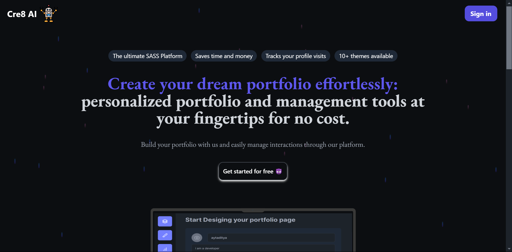


Welcome to **Cr8 AI**! This SaaS platform enables users to create beautiful, personalized portfolios without any coding knowledge. Perfect for students, professionals, or anyone needing a quick and professional portfolio under a deadline. Users can track visit counts for each project, choose from **32 different themes**, and instantly preview changes on both desktop and mobile views.

## 📖 Table of Contents

- [About](#about)
- [Features](#features)
- [Tech Stack](#tech-stack)
- [Getting Started](#getting-started)
- [Usage](#usage)
- [Project Management](#project-management)
- [Portfolio Themes](#portfolio-themes)
- [Image Storage](#image-storage)
- [Live Mobile Preview](#live-mobile-preview)
- [Authentication](#authentication)
- [Contributing](#contributing)


---

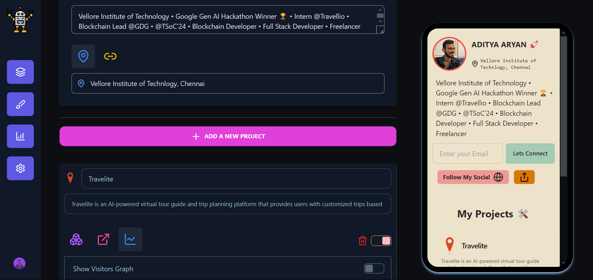

## 📝 About

Cr8 AI is a user-friendly web application designed for anyone who wants to create a portfolio without coding. It’s particularly useful for students, professionals, and individuals working under tight deadlines who want an impressive portfolio with minimal effort. Users can customize their portfolios, monitor visit counts on each project, delete projects, and control project visibility with a simple switch.

Cr8 AI leverages **Next.js** for building interactive interfaces, **Drizzle ORM** for smooth data handling with **PostgreSQL**, **Firebase** for secure image storage, and **Clerk** for user authentication. With **Daisy UI** for styling and **Framer Motion** for animations, this application delivers a visually appealing, responsive, and interactive user experience.


## ✨ Features

- **32 Unique Portfolio Themes:** Choose from a variety of themes to match your personal style.
- **Project Visit Counter:** Track the number of views on each project.
- **Image Storage with Firebase:** Securely upload images, including project banners and profile logos.
- **Live Mobile Preview:** Instantly see changes on a mobile view to ensure a responsive design.
- **Easy Customization:** Add, edit, delete, and display your projects, skills, and personal information.
- **Toggle Project Visibility:** Use a simple switch to hide or show any project on your portfolio.
- **Responsive Design:** All themes are mobile and desktop-friendly.
- **User Authentication with Clerk:** Secure sign-up and login for portfolio management.
- **Analytics Dashboard:** Access stats on visit counts and portfolio performance.
- **Social Links Integration:** Add your social media links for easy networking.

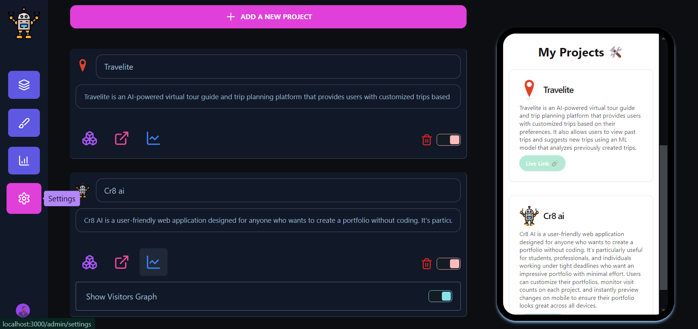


## 🛠️ Tech Stack

- **Next.js**: A powerful React-based framework for building modern web applications with SEO and server-side rendering.
- **JavaScript**: The primary language for handling client and server interactions.
- **Framer Motion**: For smooth animations and transitions.
- **Drizzle ORM**: Database ORM to manage and interact with **PostgreSQL**.
- **PostgreSQL**: The primary database for managing user and portfolio data.
- **Firebase**: For secure and scalable image storage, handling various image types like project banners and profile logos.
- **Daisy UI**: A utility-first CSS framework that provides responsive, pre-styled components.
- **Clerk**: For robust user authentication and session management.

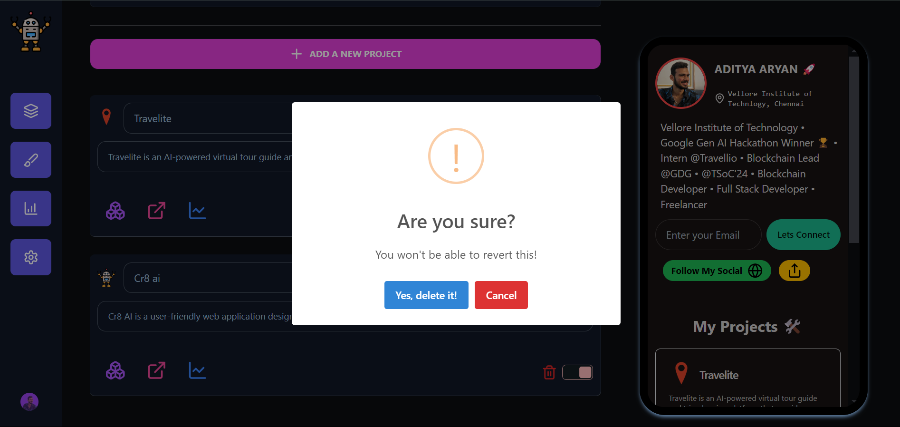

## 🚀 Getting Started

### Prerequisites

- **Node.js** (v14 or higher)
- **Git** (for cloning the repository)
- **PostgreSQL** (for database management)
- **Firebase Account** (for image storage)
- **Clerk Account** (for authentication)


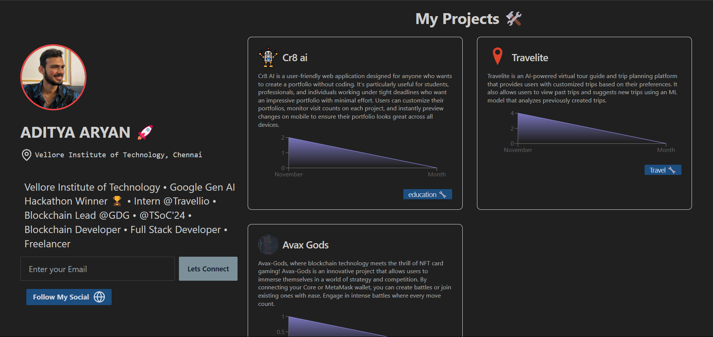
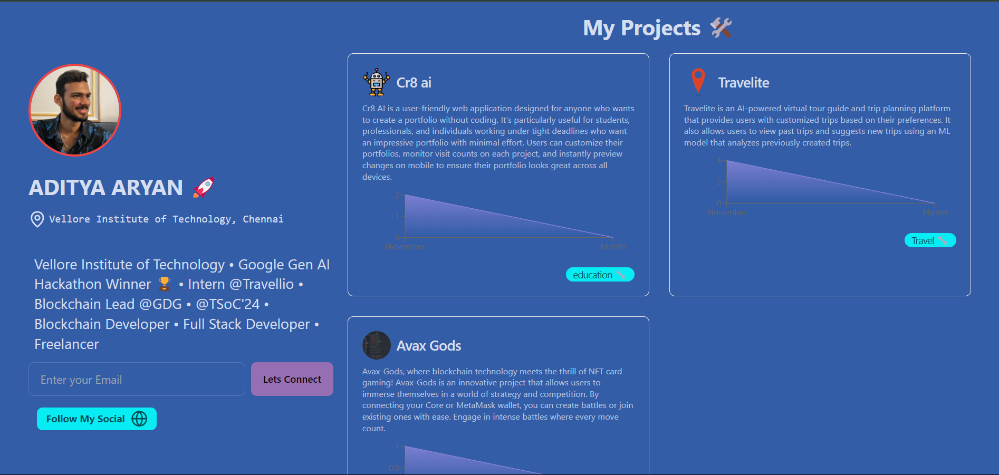


### Installation

1. **Clone the repository:**
   ```bash
   git clone https://github.com/username/cr8-ai.git
   cd cr8-ai
   ```

2. **Install dependencies:**
   ```bash
   npm install
   ```

3. **Set up environment variables:**  
   Create a `.env` file in the root directory and configure the following:

   ```plaintext
   DATABASE_URL=your_postgresql_database_url
   AUTH_SECRET=your_auth_secret
   FIREBASE_API_KEY=your_firebase_api_key
   FIREBASE_AUTH_DOMAIN=your_firebase_auth_domain
   FIREBASE_PROJECT_ID=your_firebase_project_id
   FIREBASE_STORAGE_BUCKET=your_firebase_storage_bucket
   FIREBASE_MESSAGING_SENDER_ID=your_firebase_messaging_sender_id
   FIREBASE_APP_ID=your_firebase_app_id
   CLERK_API_KEY=your_clerk_api_key
   ```

4. **Run the application:**
   ```bash
   npm run dev
   ```

5. **Access the app:**  
   Open [http://localhost:3000](http://localhost:3000) in your browser.

## 🎨 Usage

1. **Create an Account:** Sign up and log in securely using Clerk authentication to manage your portfolio.
2. **Add Projects:** Use the dashboard to add your projects, including descriptions, images, and links.
3. **Upload Images:** Add different types of images, like a banner for each project and a profile logo, which are securely stored in Firebase.
4. **Choose a Theme:** Go to the "Themes" section and select from 32 available themes.
5. **Track Project Views:** View the visit count for each project on your dashboard to see which projects are popular.

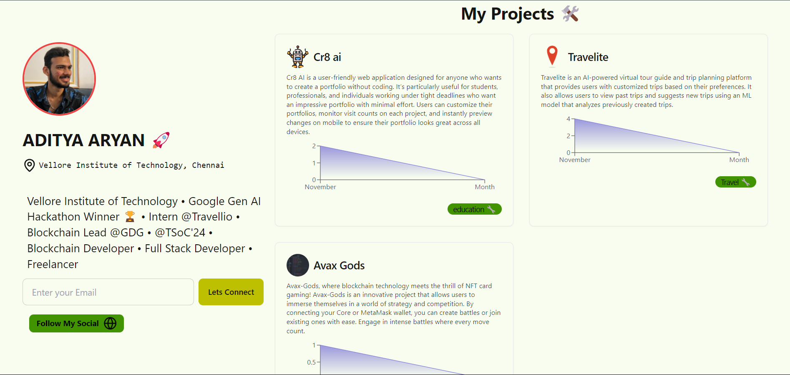
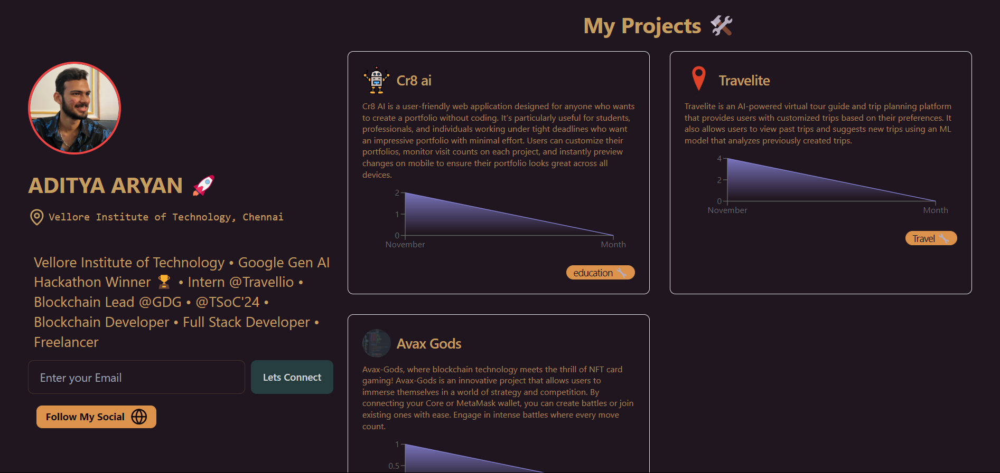

## 🗂️ Project Management

With Cr8 AI, users have complete control over their projects:

- **Add/Remove Projects**: Easily add new projects or remove existing ones from your portfolio.
- **Toggle Project Visibility**: Use a simple switch to hide or display specific projects on your portfolio without deleting them. Perfect for managing which projects you want to showcase at any time.
- **Track Project Views**: Each project page includes a visit counter that updates automatically whenever someone views the project, helping you identify which projects 
attract the most attention.

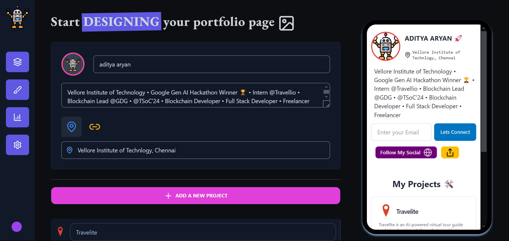
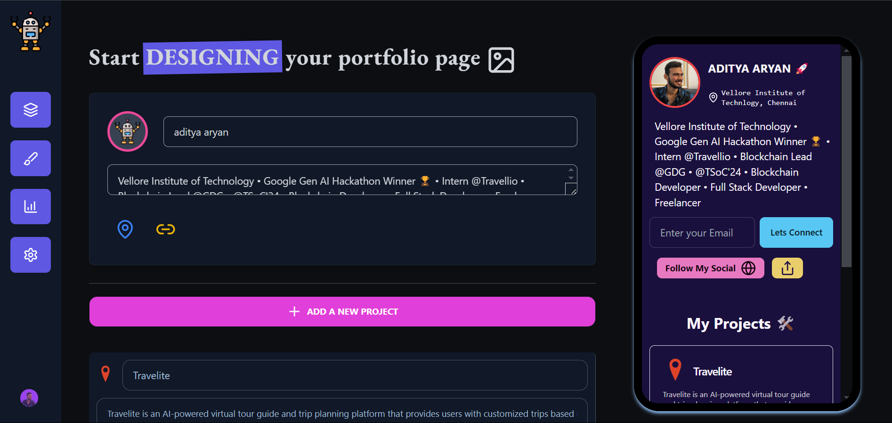

## 🎨 Portfolio Themes

With **32 different themes** to choose from, users can tailor the visual style of their portfolio to reflect their personal or professional brand. Themes range from minimalist to vibrant, modern, and classic layouts. Explore the options in the "Themes" section and preview each theme before applying it to your portfolio.

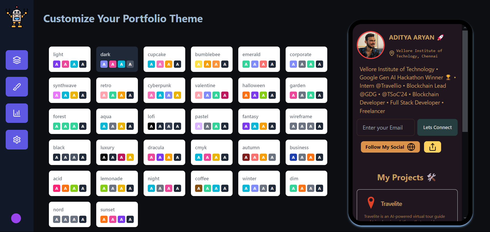


## 🖼️ Image Storage

This application allows users to upload images for their portfolio, such as:

- **Portfolio Project Banner**: The main image displayed for each project.
- **Profile Logo**: A logo or avatar image representing the user.

Uploaded images are stored securely in **Firebase Storage**, providing fast and reliable access to user-uploaded images optimized for web performance.

## 📱 Live Mobile Preview

The **Live Mobile Preview** feature lets users view their portfolio in real-time on a mobile layout, making it easy to see how changes appear on smaller screens. This ensures that portfolios are fully responsive and optimized for both desktop and mobile users.

## 🔐 Authentication

User authentication is handled via **Clerk**, ensuring secure and reliable access to each user’s portfolio. Clerk’s robust authentication system allows users to sign up and log in seamlessly, providing a secure environment for creating and managing portfolios.

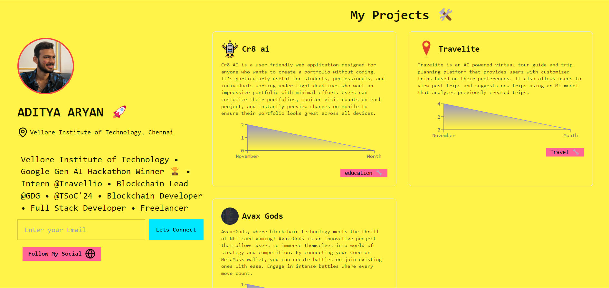
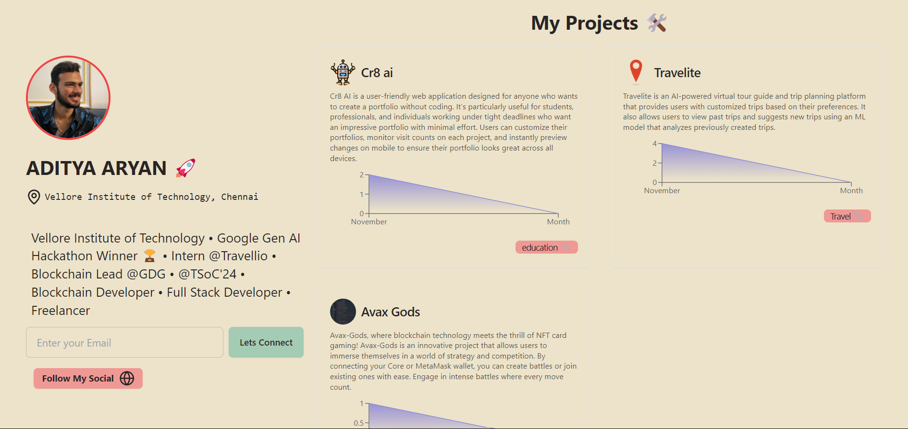

## 🤝 Contributing

We welcome contributions! If you'd like to contribute:

1. Fork the repository.
2. Create a new branch (`feature/YourFeatureName`).
3. Commit your changes.
4. Open a pull request.

Please see the `CONTRIBUTING.md` for more details.


